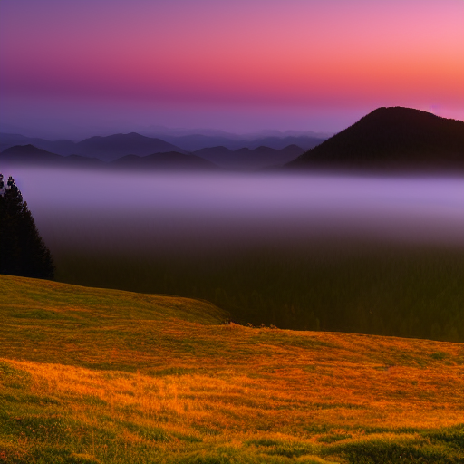
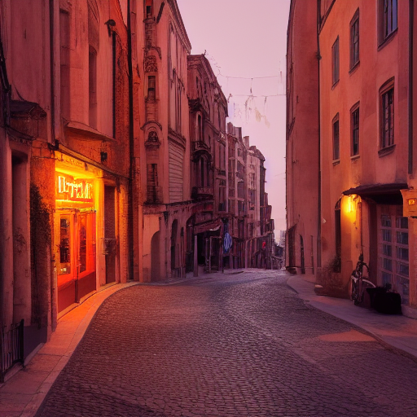
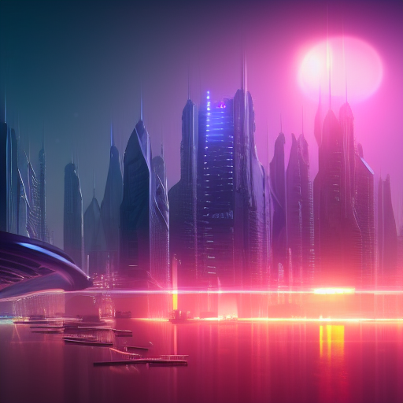

# Stable Diffusion v1.5 — From Scratch Implementation

🔗 Live Demo: https://huggingface.co/spaces/THEGODX/Text-To-Image-Generation

This project is a **from-scratch implementation of Stable Diffusion v1.5 inference in PyTorch**.  
All architectural components and the full inference pipeline are written manually, with **no reliance on prebuilt diffusion libraries or pipelines**. The official Stable Diffusion v1.5 checkpoint is used **only to load pretrained weights**, not code or structure.

The goal of this repository is clarity, correctness, and a deep understanding of how modern latent diffusion models work end to end.

---

## What Is Stable Diffusion?

Stable Diffusion is a **latent diffusion model** for **text-to-image generation**. Instead of generating images directly in pixel space, it operates in a **compressed latent space**, which makes generation faster and more memory-efficient while preserving visual fidelity.

At a high level, Stable Diffusion combines several key ideas:

- **Latent Diffusion**  
  Images are encoded into a lower-dimensional latent space using a Variational Autoencoder (VAE). Diffusion happens in this latent space rather than pixel space.

- **Text-to-Image Generation**  
  Natural language prompts are converted into embeddings and used to condition the image generation process.

- **CLIP Conditioning**  
  A pretrained text encoder (CLIP) converts prompts into embeddings that guide the image generation toward semantic alignment with the text.

- **UNet Denoising Network**  
  A UNet predicts and removes noise from latent representations over many diffusion steps.

- **VAE Latent Space**  
  The final denoised latent is decoded back into an image using the VAE decoder.

---

## What Is Implemented From Scratch

This repository **does not use any prebuilt Stable Diffusion or diffusion pipelines** (such as `diffusers` or similar frameworks).

The following components are implemented manually:

- UNet architecture (including residual blocks and attention)
- Cross-attention for text conditioning
- Variational Autoencoder (encoder and decoder)
- DDPM sampling loop
- Classifier-Free Guidance (CFG)
- CLIP text encoder integration
- End-to-end text-to-image inference pipeline
- Scheduler logic and timestep handling

**Important clarification:**  
The official Stable Diffusion v1.5 checkpoint is used **only to load pretrained weights**.  
It provides **no architectural code, pipeline logic, or inference implementation**.  
All model definitions and execution logic are authored from scratch in this project.

---

## Image Generation Pipeline (Step-by-Step)

1. **Text Encoding**  
   The input prompt is tokenized and encoded using a CLIP text encoder, producing a sequence of text embeddings.

2. **Latent Initialization**  
   A latent tensor is initialized with Gaussian noise. This tensor represents the starting point in latent space.

3. **Diffusion Denoising**  
   Over multiple timesteps, the UNet predicts the noise component at each step and gradually removes it using a DDPM-style sampler.

4. **Classifier-Free Guidance (CFG)**  
   Both conditional and unconditional predictions are computed and combined to strengthen alignment with the text prompt.

5. **VAE Decoding**  
   The final denoised latent is decoded by the VAE decoder to produce a full-resolution RGB image.

---

## Example Outputs (Text-to-Image)

  
  
  

  
  

---

### Prompts

1. a realistic photo of a vintage camera placed on a wooden table, soft studio lighting, subtle shadows, sharp focus, detailed metal and leather textures, shallow depth of field, centered composition, professional product photography

2. a peaceful mountain landscape at sunrise, soft fog rolling through the valley, warm golden light, distant mountains fading into the horizon, natural colors, high detail, realistic landscape photography

3. a cinematic photo of a quiet street in an old European city, stone buildings with classic architecture, warm evening light, soft shadows, empty street, atmospheric mood, realistic photography

4. a futuristic city at dusk, glowing city lights, tall modern buildings, atmospheric haze, reflections on the streets, cinematic lighting, detailed environment, realistic sci-fi cityscape

5. a realistic photo of a cup of coffee on a wooden table, soft morning sunlight coming through a window, gentle shadows, steam rising from the cup, shallow depth of field, detailed textures, professional food photography

---